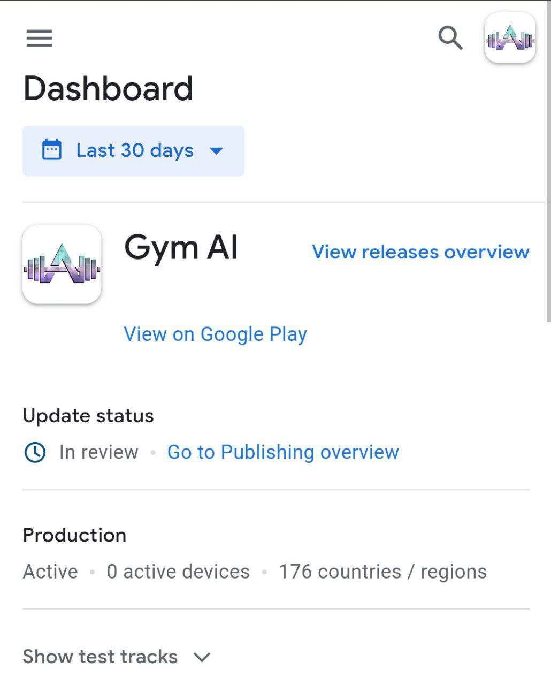

# 🏋♂ Overview

#### Gym-AI - The Mobile Evolution for Your Health in the Palm of Your Hand!

_Transform your health routine with our new app! You can plan and track your daily workouts, establish healthy habits, and create a personalized meal plan. Whether you're an athlete or just looking to improve your health, our app has everything you need to reach your goals. Download now and experience a healthier life!_

#### Gym-AI Mobile

_Maintaining a healthy lifestyle requires constant attention to nutrition and physical activity. Gym-AI is a mobile application that provides daily suggestions for both, and is a valuable tool for people looking to improve their health and well-being. The app uses data such as personal health goals, dietary preferences, and fitness levels to generate customized recommendations for each user, making meal planning and physical activity easier and helping them stay on track towards their health goals. Additionally, the app can provide reminders, track progress, and offer motivation, further promoting the adoption of healthy habits. In conclusion, Gym-AI, which offers daily suggestions for nutrition and physical activity, is a practical and convenient tool for those seeking to maintain a healthy lifestyle._

<figure><figcaption>
<em><strong>"Coming soon for all our investors/users"</strong></em>
</figcaption></figure>

#### _Gym-AI Bot_

_We have developed an AI-based bot that will bring numerous benefits to our users. It will provide quick and accurate responses to various queries from our investors, help with regulated calorie intake, and address some concentration issues. It will also provide steps to improve your habits and offer the best workout options based on your needs. Of course, it will be a partner for everything to our investors. It will be like a psychologist, personal trainer, nutritionist, and more. We are Gym-AI, the revolution in the health and cryptocurrency industries._



__

\
