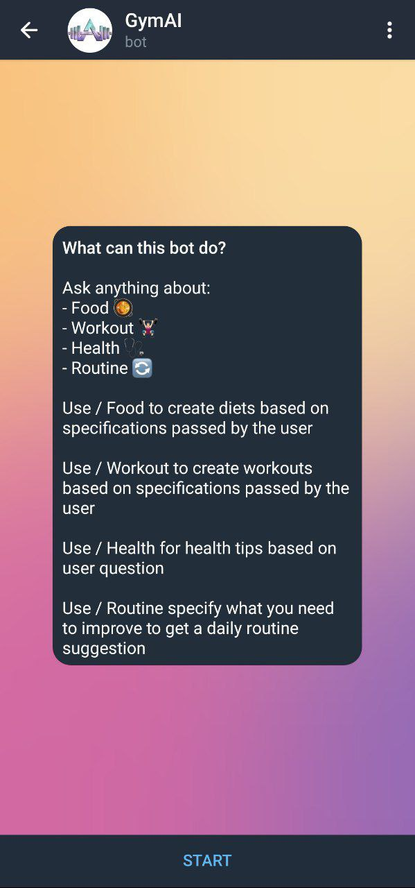

# 🏋♂ Gym-AI Bot

## Gym-AI Bot

_The Artificial Intelligence is important in sports practices because it can help improve the performance of athletes. For example, the use of data analysis systems can provide valuable information about game strategies, physical performance and injury trends, allowing coaches to make more informed decisions and adjust their training approach._

_Regarding nutrition, Artificial Intelligence can help monitor and customize the nutrition of athletes, ensuring that they are receiving the correct amount of nutrients to support their sports performance. Additionally, AI can also be used to develop personalized diet plans for individuals based on their nutritional goals and specific needs._

_From these points, we have developed a Telegram bot that will address various factors in order to help all of our users. It will bring calorie-based nutrition routines, exercise routines and much more! An infinite number of options with our Gym-AI bot!_

<figure><figcaption>
<em>That is our initial mask</em>
</figcaption></figure>



