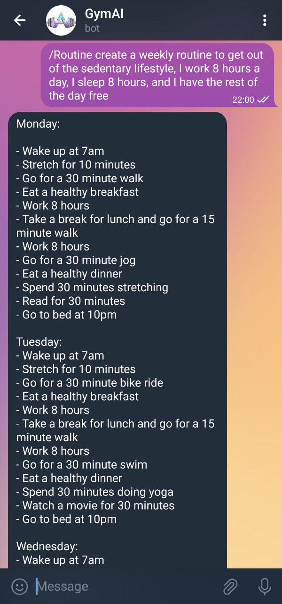
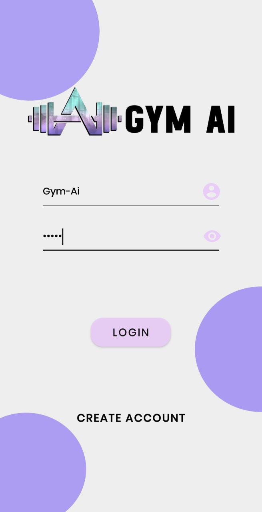
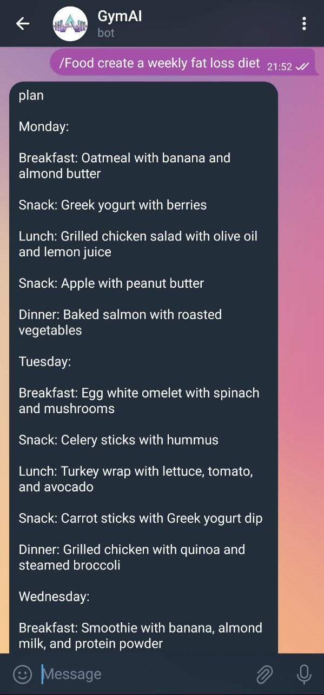
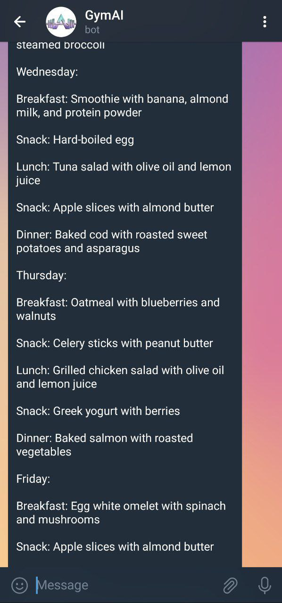
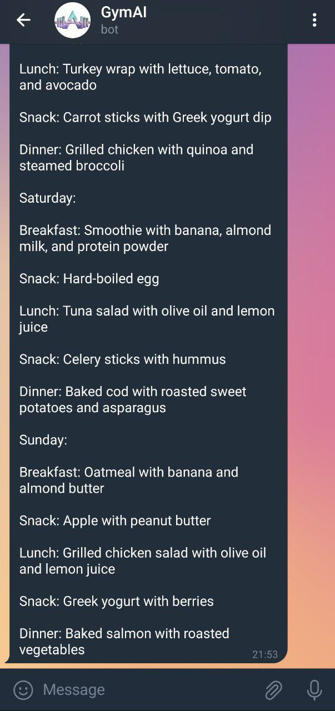

# ▪ Some examples BOT

#### /ROUTINE - Create a weekly routine to get out of the  sedentary lifestyle. I work 8 hours a day, 1 sleep 8 hours, and i have the rest of the day free.

<figure><figcaption></figcaption></figure>

 

<figure><figcaption></figcaption></figure>

 

<figure><figcaption></figcaption></figure>

#### /FOOD - Create a weekly fat loss diet

<figure><figcaption></figcaption></figure>

 

<figure><figcaption></figcaption></figure>

 

<figure><figcaption></figcaption></figure>

