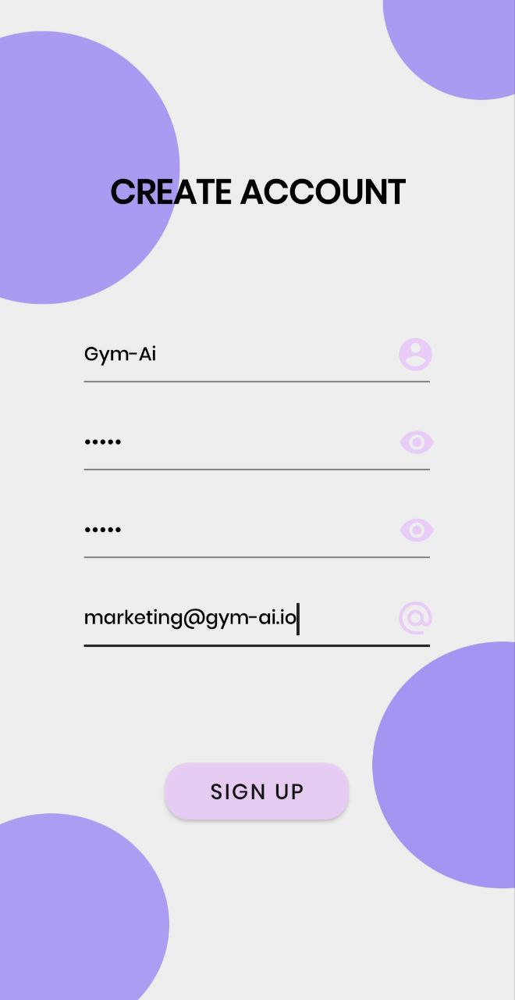

# ▪ Initial Signup

## For the first access, just follow these steps:

<figure><figcaption>
<em><strong>Just click on "CREATE ACCOUNT"</strong></em>
</figcaption></figure>

 

<figure><figcaption>
<em><strong>Fill in the particular data, and click on "SIGN UP".</strong></em>
</figcaption></figure>

 

<figure><figcaption>
<em><strong>After registering, start the app with your data</strong></em>
</figcaption></figure>

\
