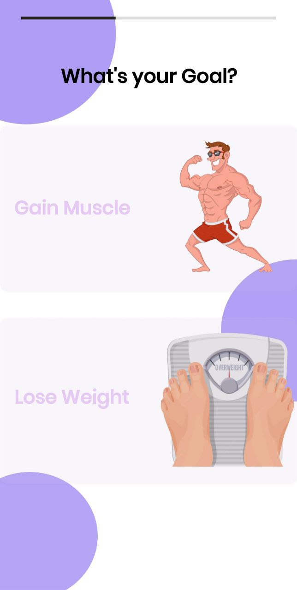
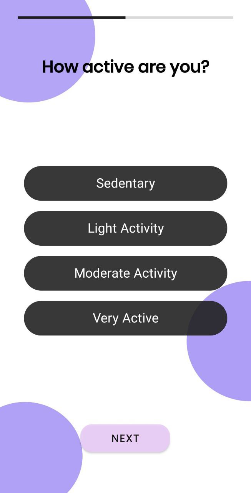
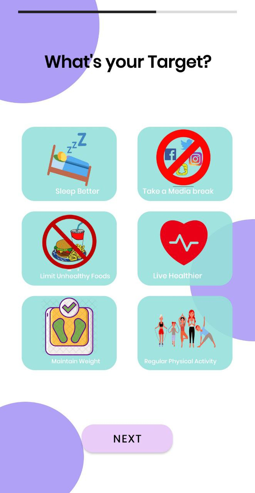

# ▪ What's your Goal?

#### We will now enter the goals stage, and initially have two parameters to choose from:

* [x] Gain Muscle&#x20;
* [x] Lose Weight

#### After this stage, based on your choice, we will collect information, so that through AI we can process the best options for our users.

* [x] How active are you?&#x20;
* [x] What is your target?

<figure><figcaption></figcaption></figure>

 

<figure><figcaption></figcaption></figure>

 

<figure><figcaption></figcaption></figure>

